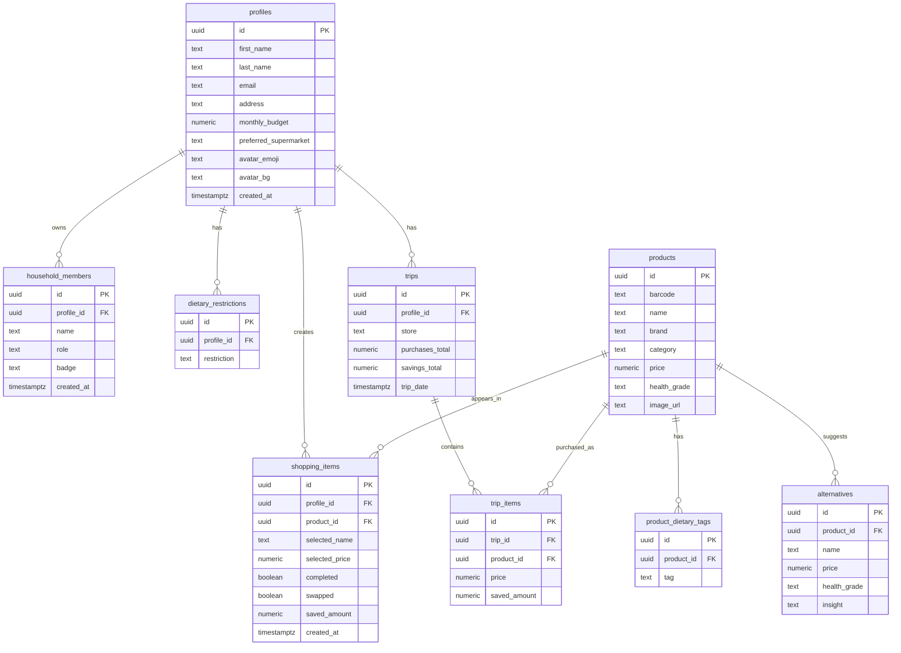

# SmartCart

SmartCart היא אפליקציית קניות חכמה בעברית שמלווה משתמשים בזמן קנייה בסופר, עוזרת לעמוד בתקציב, מציעה החלפות זולות/בריאות יותר, ומנהלת רשימת קניות שלומדת מהרגלי הקנייה.

## קישורים

- אתר חי ב-Vercel: יתווסף אחרי התחברות ל-Vercel והרצת deployment.
- סביבת פיתוח מקומית: `http://127.0.0.1:5174/`
- ריפו GitHub: יש להעלות כריפו ציבורי לפני ההגשה.

## הבעיה

בקנייה שבועית קשה לעקוב בזמן אמת אחרי תקציב, השוואת מחירים, מוצרים בריאים יותר והרגלים חוזרים של הבית. רוב האנשים משתמשים ברשימות בוואטסאפ, פתקים, אקסל או זיכרון, ולכן מפספסים חיסכון ומגלים חריגה רק בקופה.

SmartCart מרכזת את תהליך הקנייה במקום אחד: בחירת סופר, תקציב, סריקת מוצרים מדומה, המלצות החלפה, רשימת קניות, תובנות חיסכון ופרופיל משק בית.

## קהל יעד

- משפחות ושותפים שמנהלים תקציב קניות משותף.
- סטודנטים או יחידים שרוצים לשלוט בהוצאות בסופר.
- משתמשים עם העדפות תזונה כמו צמחוני, טבעוני, ללא גלוטן או ללא לקטוז.
- קונים שרוצים לדעת בזמן הקנייה אם יש חלופה זולה או בריאה יותר.

## מתחרים ובידול

| פתרון קיים | מגבלה | הבידול של SmartCart |
| --- | --- | --- |
| וואטסאפ/פתקים | רשימה ידנית בלי תקציב, תובנות או החלפות | רשימה אינטראקטיבית עם תקציב והמלצות |
| אקסל | לא נוח בזמן קנייה ולא מותאם למובייל | ממשק קנייה מהיר ורספונסיבי |
| אפליקציות סופר | ממוקדות ברשת אחת | קטלוג כללי עם מגוון רשתות וסופרים |
| השוואת מחירים ידנית | דורש עבודה בזמן אמת | מנוע החלפות מדומה שמציג חיסכון ובריאות |

## פיצ'רים מרכזיים

- עמוד בית בעברית עם תקציב, פעולות מהירות וטיפ חיסכון.
- בחירת סופר מתוך רשתות מזון בישראל.
- סורק ברקוד מדומה עם מוצרים אמיתיים/דמויים, ברקודים ותמונות.
- מנוע `Swap & Save` שמציע חלופה זולה או בריאה יותר.
- קטלוג סופר רחב עם פירות, ירקות, מוצרי יסוד, חלב, בשר, ניקיון, היגיינה, מאפים, קפואים ונשנושים.
- רשימת קניות עם סימון מוצרים, קטגוריות וסיכום תקציב.
- תובנות חיסכון וגרפים בעזרת Recharts.
- פרופיל משתמש עבור מאי כהן, בחירת אווטאר, העדפות תזונה ומשק בית.
- שמירה מקומית של הנתונים בעזרת `localStorage`.

## נתוני דמו

- משתמשת דמו: מאי כהן.
- אימייל דמו: `may.cohen@smartcart.local`
- תקציב חודשי דמו: `₪1200`
- סופר מועדף התחלתי: רמי לוי.
- מוצרים לדוגמה: חמאה, במבה, אורז יסמין, אפרופו, שמנת, שעועית ירוקה, פירות/ירקות ומוצרי קטלוג נוספים.

## טכנולוגיות

- React 19
- Vite
- Recharts
- CSS מותאם RTL
- Browser Cache Storage API לתמונות חיצוניות כאשר רלוונטי
- `localStorage` לשמירת מצב משתמש, רשימת קניות ופרופיל

## שירותים חיצוניים ואינטגרציות

| שירות | סוג | שימוש בפרויקט |
| --- | --- | --- |
| Vercel | Deployment | העלאת האתר כגרסה חיה ונגישה להגשה |
| OpenFoodFacts / מקורות מוצר | נתוני מוצר ותמונות | מקור ראשוני לחלק מתמונות וברקודים של מוצרים |
| OpenAI API | API בינה מלאכותית | תשובות חכמות לעוזר ההדרכה בצ'אט |
| Browser Cache Storage API | API בדפדפן | שמירת תמונות HTTP במטמון מקומי לטעינה מהירה |
| localStorage | אחסון לקוח | שמירת פרופיל, תקציב, רשימה והעדפות ללא שרת |
| Recharts | ספריית UI/גרפים | הצגת תובנות חיסכון וקניות |

## מודל נתונים ו-ERD

הגרסה הנוכחית היא Client Persisted App: הנתונים נשמרים ב-`localStorage`. אם מחברים Supabase, זהו מודל הנתונים המתוכנן:



## זרימה מרכזית לבדיקה

1. פותחים את עמוד הבית.
2. לוחצים על התחלת קנייה.
3. בוחרים סופר ומוודאים שהסימון עובר לסופר שנבחר.
4. עוברים לסריקה.
5. בוחרים מוצר מהרשימה המדומה.
6. בודקים מחיר, דירוג בריאות וחלופת חיסכון.
7. מוסיפים מוצר מקורי או בוחרים החלפה.
8. עוברים לרשימת הקניות ורואים תקציב, קטגוריות וסימון מוצרים.
9. עוברים לתובנות ורואים גרפים וקבלות.
10. עוברים לפרופיל, משנים אווטאר, העדפות תזונה ומוסיפים אדם למשק הבית.

## התקנה והרצה מקומית

```powershell
npm install
npm run dev
```

ברירת מחדל של Vite:

```text
http://localhost:5173/
```

בסביבת הפיתוח הנוכחית האתר רץ גם ב:

```text
http://127.0.0.1:5174/
```

## Build

```powershell
npm run build
```

תיקיית הפלט היא:

```text
dist/
```

## Deployment ל-Vercel

לאחר התחברות ל-Vercel:

```powershell
npx vercel login
npx vercel --prod
```

הגדרות מומלצות:

- Framework: Vite
- Build Command: `npm run build`
- Output Directory: `dist`
- Install Command: `npm install`

כדי להפעיל את עוזר ה-AI ב-Vercel יש להגדיר Environment Variable:

```text
OPENAI_API_KEY=your_openai_api_key
```

אופציונלי:

```text
OPENAI_MODEL=gpt-4.1-mini
```

## מצב נוכחי

- האפליקציה עובדת כ-Frontend מלא עם התמדה מקומית.
- אין כרגע Backend פעיל או Supabase מחובר בפועל.
- ERD מופיע במסמך כמודל מתוכנן לחיבור Backend.
- Deployment ל-Vercel דורש התחברות תקפה במחשב לפני העלאה.
