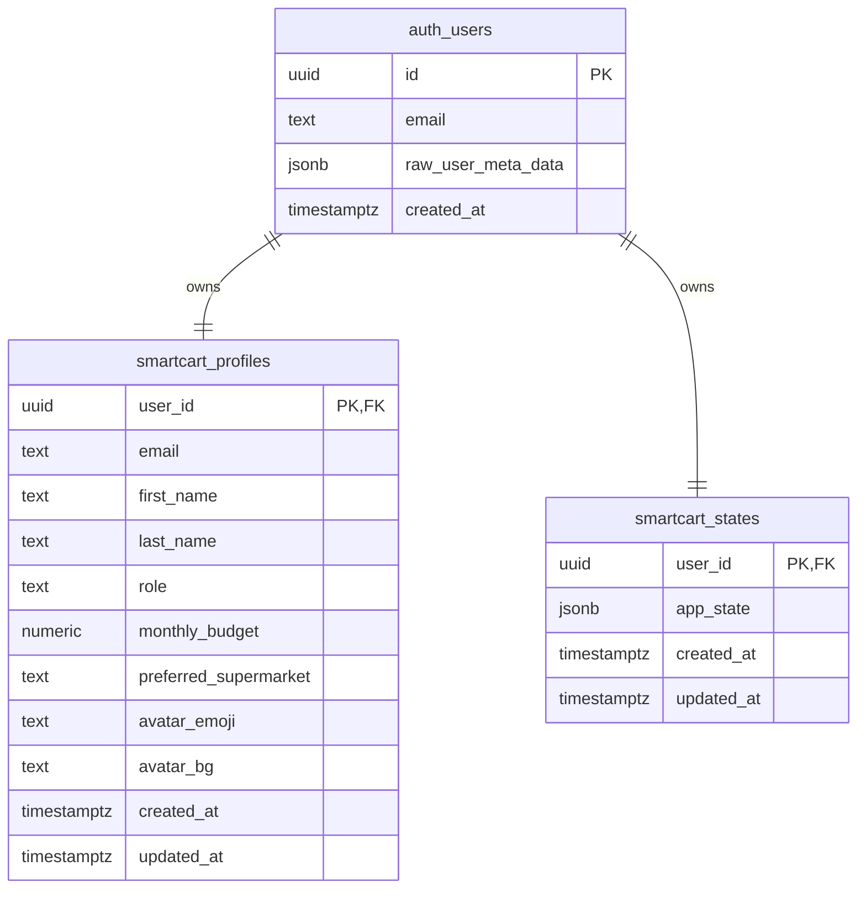

# SmartCart

SmartCart היא אפליקציית קניות חכמה בעברית שמלווה משתמשים בזמן קנייה בסופר, עוזרת לעמוד בתקציב, מציעה חלופות זולות או בריאות יותר, ומנהלת רשימת קניות שנשמרת לכל משתמש רשום.

## קישורים

- אתר חי ב-Vercel: https://smartcart-project-ruddy.vercel.app
- ריפו GitHub: https://github.com/mimi5588/smartcart-project
- ERD: מופיע בהמשך המסמך

## הבעיה

במהלך קנייה שבועית קשה לעקוב בזמן אמת אחרי תקציב, מחירים, חלופות בריאות והרגלים חוזרים של הבית. הרבה משתמשים נעזרים בוואטסאפ, פתקים או זיכרון, ולכן מגלים חריגה רק בקופה ומפספסים הזדמנויות לחיסכון.

SmartCart מרכזת את התהליך במקום אחד: בחירת סופר, הגדרת תקציב, סריקת מוצרים מדומה, המלצות החלפה, רשימת קניות, תובנות חיסכון ופרופיל משק בית.

## קהל יעד

- משפחות ושותפים שמנהלים תקציב קניות משותף.
- סטודנטים ויחידים שרוצים לשלוט בהוצאות בסופר.
- משתמשים עם העדפות תזונה כמו צמחוני, טבעוני, ללא גלוטן או ללא לקטוז.
- קונים שרוצים לראות בזמן הקנייה אם קיימת חלופה זולה או בריאה יותר.

## מתחרים ובידול

| פתרון קיים | מגבלה | הבידול של SmartCart |
| --- | --- | --- |
| וואטסאפ או פתקים | רשימה ידנית בלי תקציב, תובנות או החלפות | רשימה אינטראקטיבית עם תקציב והמלצות |
| אקסל | לא נוח בזמן קנייה ולא מותאם למובייל | ממשק קנייה מהיר ורספונסיבי |
| אפליקציות סופר | ממוקדות ברשת אחת | קטלוג כללי עם כמה רשתות וסופרים |
| השוואת מחירים ידנית | דורשת עבודה בזמן אמת | מנוע החלפות שמציג חיסכון ובריאות |

## פיצ'רים מרכזיים

- הרשמה והתחברות עם מייל וסיסמה דרך Supabase Auth.
- שמירת מצב משתמש, פרופיל ורשימת קניות ב-Supabase.
- עמוד בית בעברית עם תקציב, פעולות מהירות וטיפ חיסכון.
- בחירת סופר והגדרת תקציב דינמית.
- סורק ברקוד מדומה עם מוצרים, מחירים, דירוג בריאות וחלופות.
- קטלוג מוצרים והוספה ידנית של מוצר שלא קיים בקטלוג.
- רשימת קניות עם סימון מוצרים, חישוב תקציב וחיסכון בזמן אמת.
- תובנות חיסכון וגרפים בעזרת Recharts.
- פרופיל משתמש, העדפות תזונה ומשק בית.

## נתוני בדיקה

ניתן ליצור משתמש חדש ישירות במסך ההרשמה באמצעות מייל וסיסמה. לאחר התחברות המערכת יוצרת מצב התחלתי לכל משתמש ושומרת את השינויים שלו ב-Supabase.

משתמש מנהל קיים במערכת:

- אימייל: `maycohen5588@gmail.com`
- הרשאות: `admin`

## שירותים חיצוניים ואינטגרציות

| שירות | סוג | שימוש בפרויקט |
| --- | --- | --- |
| Supabase Auth | אותנטיקציה | הרשמה והתחברות עם מייל וסיסמה |
| Supabase Postgres | בסיס נתונים | שמירת פרופיל ומצב אפליקציה לכל משתמש |
| Supabase RLS | אבטחת מידע | הפרדת נתונים לפי `auth.uid()` |
| Vercel | Deployment | העלאת האתר כגרסת production חיה |
| Recharts | ספריית UI | גרפים ותובנות חיסכון |
| Vite/React | Frontend | בניית ממשק המשתמש |

## מודל נתונים ו-ERD



## אבטחת גישה

שתי הטבלאות הציבוריות מוגנות ב-RLS:

- משתמש מחובר יכול לקרוא ולעדכן רק את הרשומה שלו.
- אין גישה אנונימית לנתוני משתמשים.
- הרשאת מנהל נשמרת ב-`smartcart_profiles.role` ולא בקוד צד לקוח בלבד.

## זרימה מרכזית לבדיקה

1. פותחים את האתר החי ב-Vercel.
2. נרשמים עם מייל וסיסמה או מתחברים עם משתמש קיים.
3. עוברים למסך ההגדרה ובוחרים סופר.
4. משנים תקציב ומוודאים שהמספר מתעדכן.
5. מתחילים קנייה וסורקים/בוחרים מוצר.
6. מוסיפים מוצר מקורי או חלופה חסכונית.
7. עוברים לרשימת הקניות ובודקים תקציב, סימון מוצרים וחיסכון.
8. עוברים לתובנות ורואים גרפים וקבלות.
9. עוברים לפרופיל, משנים העדפות ומוסיפים אדם למשק הבית.
10. מתנתקים ומתחברים שוב כדי לוודא שהמידע נשמר.

## התקנה והרצה מקומית

```powershell
npm install
npm run dev
```

קובץ `.env.local` נדרש להרצה מול Supabase:

```text
VITE_SUPABASE_URL=your_supabase_project_url
VITE_SUPABASE_PUBLISHABLE_KEY=your_supabase_publishable_key
```

## Build

```powershell
npm run build
```

תיקיית הפלט:

```text
dist/
```

## Deployment

הפרויקט מחובר ל-Vercel כפרויקט Vite:

- Build Command: `npm run build`
- Output Directory: `dist`
- Install Command: `npm install`

Production URL:

```text
https://smartcart-project-ruddy.vercel.app
```
