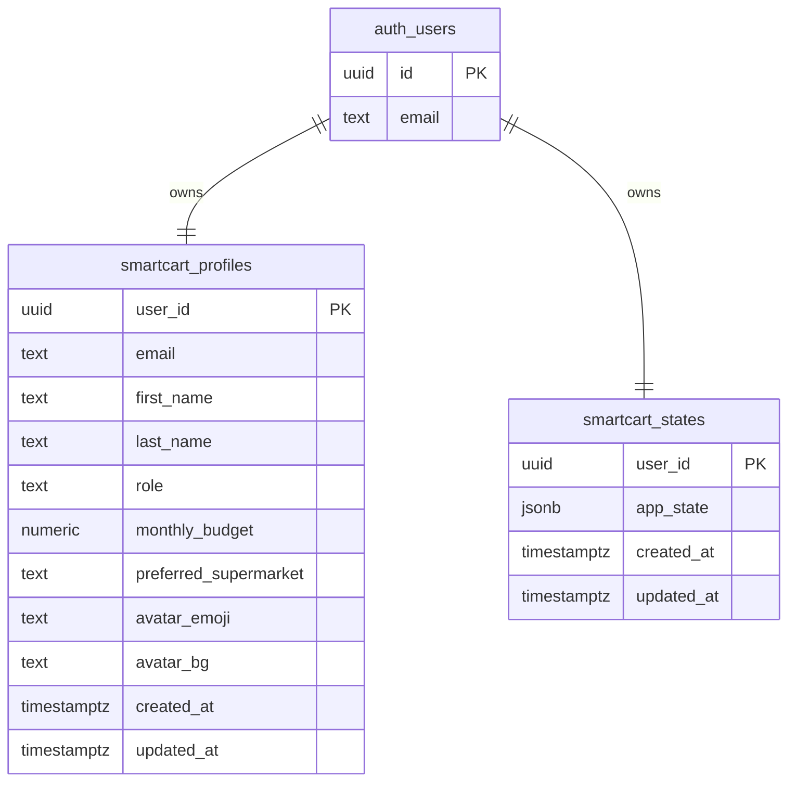

# SmartCart Supabase ERD

The production app now uses Supabase Auth for real email/password users. Each authenticated user owns one profile row and one persisted SmartCart state row.

## Table details

| Table | Column | Type | Notes |
| --- | --- | --- | --- |
| `public.smartcart_profiles` | `user_id` | `uuid` | Primary key and foreign key to `auth.users(id)`. |
| `public.smartcart_profiles` | `email` | `text` | Unique email copied from Supabase Auth for display and lookup. |
| `public.smartcart_profiles` | `role` | `text` | `user` or `admin`. The configured owner account is `admin`. |
| `public.smartcart_profiles` | `monthly_budget` | `numeric` | Profile budget used by the app. |
| `public.smartcart_states` | `user_id` | `uuid` | Primary key and foreign key to `auth.users(id)`. |
| `public.smartcart_states` | `app_state` | `jsonb` | Full SmartCart client state: profile preferences and shopping list. |

## Access control

- Row Level Security is enabled on both app tables.
- Authenticated users can select, insert, and update only rows where `user_id = auth.uid()`.
- `anon` has no direct app-table grants.
- No Supabase service-role key is exposed in the frontend.
