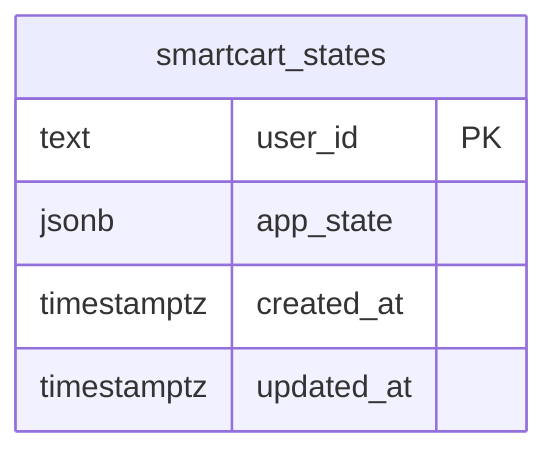

# SmartCart Supabase ERD

The current production implementation stores the demo application's persisted user state in one Supabase table. This keeps the submitted demo stable while preserving a clear upgrade path to normalized product, trip, household, and shopping-item tables later.

## Table details

| Table | Column | Type | Notes |
| --- | --- | --- | --- |
| `public.smartcart_states` | `user_id` | `text` | Primary key. Limited by check constraint to the demo users `may` and `noa`. |
| `public.smartcart_states` | `app_state` | `jsonb` | Full SmartCart client state: profile, budget, household, preferences, and shopping list. |
| `public.smartcart_states` | `created_at` | `timestamptz` | Defaults to `now()`. |
| `public.smartcart_states` | `updated_at` | `timestamptz` | Defaults to `now()` and is updated by trigger on row updates. |

## Access control

- Row Level Security is enabled.
- `anon` can `select`, `insert`, and `update` only the allowed demo user rows.
- `authenticated` has the same demo-row policies, with delete grant available for future authenticated flows.
- No Supabase service-role key is exposed in the frontend.

## Future normalized model

The README includes the planned normalized ERD for a fuller production backend with profiles, products, dietary tags, alternatives, shopping items, trips, and trip items.

